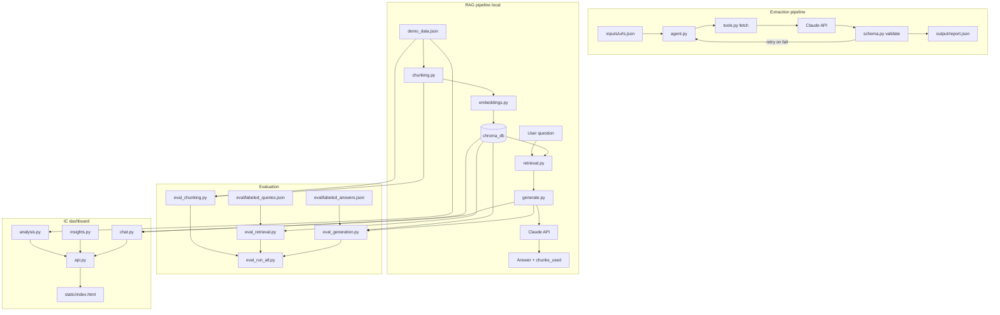

# Due Diligence News Agent

An end-to-end research automation project for private-equity due diligence on the food manufacturing and FMCG sector. It combines an **agentic extraction pipeline** (scrape → Claude → schema validation → JSON report) with a **local RAG layer** (chunk → embed → Chroma → grounded Q&A with citations).

Built to replace manual analyst review of hundreds of trade-press articles with consistent, structured output.

---

## For reviewers — start here

If you are evaluating this repo, you do not need access to private data:

```bash
git clone https://github.com/jieyissee-arch/due-diligence-agent.git
cd due-diligence-agent
pip install -r requirements.txt
cp .env.example .env          # add ANTHROPIC_API_KEY for generation / extraction demos
cp demo_data.example.json demo_data.json

# RAG quickstart (~5 min, synthetic corpus)
HF_HUB_OFFLINE=1 TRANSFORMERS_OFFLINE=1 PYTHONPATH=src python3 src/build_index.py
PYTHONPATH=src python3 src/eval_run_all.py --suite example --offline

# Dashboard (requires built index + ANTHROPIC_API_KEY for briefing/chat)
HF_HUB_OFFLINE=1 TRANSFORMERS_OFFLINE=1 PYTHONPATH=src python3 src/api.py
# Open http://127.0.0.1:7860

# Extraction quickstart (5 public article URLs in inputs/urls.json)
python3 src/agent.py
```

**What to look at in the code:**

| Area | Files | What it demonstrates |
|------|-------|----------------------|
| Agent loop + retries | [`src/agent.py`](src/agent.py) | Claude extraction with validation-driven retry |
| Output quality | [`src/schema.py`](src/schema.py) | Strict JSON schema, five-category taxonomy |
| RAG retrieval | [`src/retrieval.py`](src/retrieval.py) | Local Chroma, cosine similarity, provider consistency checks |
| Grounded generation | [`src/generate.py`](src/generate.py) | Retrieved passages in prompt, citation instructions |
| Dashboard analysis | [`src/analysis.py`](src/analysis.py) | Pandas aggregations, KPIs, quarterly/growth signals |
| AI briefings | [`src/insights.py`](src/insights.py) | Claude findings by investment theme + urgency; cached JSON |
| Analyst chat | [`src/chat.py`](src/chat.py) | History-aware RAG drill-down |
| Dashboard API + UI | [`src/api.py`](src/api.py), [`src/static/index.html`](src/static/index.html) | FastAPI REST + single-page IC dashboard |
| Retrieval eval | [`src/eval_retrieval.py`](src/eval_retrieval.py), [`eval/labeled_queries.json`](eval/labeled_queries.json) | Labeled queries, category_hit@k, MRR |
| Generation eval | [`src/eval_generation.py`](src/eval_generation.py), [`eval/labeled_answers.json`](eval/labeled_answers.json) | Citation validity, term grounding, abstention |
| Eval orchestrator | [`src/eval_run_all.py`](src/eval_run_all.py) | Chunking + retrieval + generation; writes `output/eval_report.json` |
| CI (RAG eval) | [`.github/workflows/rag_eval.yml`](.github/workflows/rag_eval.yml) | Offline example suite on synthetic corpus |
| CI | [`.github/workflows/run_agent.yml`](.github/workflows/run_agent.yml) | Scheduled extraction via GitHub Actions |

---

## Problem

Due diligence teams monitoring food manufacturing need to track corporate events across trade press: site closures, expansions, new builds, product launches, and packaging changes. Manual extraction from hundreds of articles is slow, inconsistent, and hard to query retrospectively.

## Solution

Two complementary pipelines:

1. **Extraction** — fetch articles, extract structured events with Claude, validate against a schema, retry on failure, write a consolidated report. Runnable locally or via GitHub Actions.
2. **RAG** — index extracted events locally, retrieve relevant passages by semantic search, answer analyst questions with Claude grounded in retrieved chunks and explicit source citations.
3. **IC dashboard** — FastAPI backend + browser UI presenting KPIs, investment-theme charts (Plotly), Claude-generated findings, and an "Ask me…" RAG chat for drill-down.

A companion private data repo (`news_scrape_mar26`) holds the full scraped and extracted corpus (~2k+ events from 3k articles). This public repo ships code, a synthetic fixture, and eval queries — not real research data.

---

## Tech stack

| Layer | Choice | Rationale |
|-------|--------|-----------|
| LLM | Claude Haiku (`claude-haiku-4-5-20251001`) | Low cost, fast enough for batch extraction and RAG answers |
| Embeddings | `sentence-transformers` / `all-MiniLM-L6-v2` | Free, local, no API key for indexing |
| Vector store | Chroma (persistent, local) | Simple local demo; cosine similarity |
| Web fetch | `httpx` + `beautifulsoup4` | Article text extraction |
| Orchestration | GitHub Actions | Unattended extraction runs |
| Language | Python 3.9+ | |

---

## Architecture



### Event taxonomy

All extractions map to five due-diligence categories (see [`src/schema.py`](src/schema.py)):

- **CLOSURES** — manufacturing site or facility shutdowns
- **EXPANSIONS** — investment in existing sites or lines
- **NEW_BUILDS** — new facility construction or opening
- **PRODUCT_LAUNCHES** — new products or ranges
- **PACKAGING** — packaging material or design changes (especially sustainability)

### Key design decisions

- **Validation before acceptance** — Claude output is parsed and schema-checked; failed extractions trigger a reinforced retry prompt (up to 3 attempts) rather than silently accepting bad JSON.
- **Local-first RAG** — embeddings and Chroma run on-machine; no hosted vector DB or embedding API required for demos.
- **Swappable embedding provider** — `sentence-transformers` by default; optional Voyage AI via env config. Retrieval validates provider/model matches index metadata.
- **Traceable RAG answers** — prompts label passages `[Passage N]`; Claude is instructed to cite source and date; `chunks_used` returned alongside the answer.
- **Eval without golden corpus in repo** — labeled query/answer JSON files hold expected categories, sources, and grounding checks; metrics computed against whatever index is built locally.
- **Data boundary** — real extracted events stay in gitignored `demo_data.json`; public quickstart uses [`demo_data.example.json`](demo_data.example.json).

---

## Project structure

```
due-diligence-agent/
├── src/
│   ├── agent.py              # Extraction agent loop
│   ├── tools.py              # Article fetch + text cleanup
│   ├── schema.py             # Event validation
│   ├── chunking.py           # Passage splitting + metadata
│   ├── embeddings.py         # Local / API embedding providers
│   ├── retrieval.py          # Chroma index + retrieve()
│   ├── generate.py           # RAG prompt + Claude generation
│   ├── build_index.py        # Chunk → embed → Chroma (one shot)
│   ├── analysis.py           # Dashboard aggregations + KPI derivation
│   ├── insights.py           # Claude briefing (themed findings, cached)
│   ├── chat.py               # History-aware RAG chat
│   ├── api.py                # FastAPI backend for dashboard + chat
│   ├── static/index.html     # IC dashboard single-page UI
│   ├── eval_chunking.py      # Chunking invariant checks
│   ├── eval_retrieval.py     # Retrieval metrics
│   ├── eval_generation.py    # Generation grounding metrics
│   ├── eval_scoring.py       # Pure scoring helpers (unit tested)
│   ├── eval_common.py        # Suite filter, thresholds, report writer
│   └── eval_run_all.py       # Run full eval suite
├── eval/
│   ├── labeled_queries.json  # Retrieval eval query set
│   ├── labeled_answers.json  # Generation eval query set
│   └── thresholds.json       # Per-suite pass thresholds
├── tests/
│   └── test_eval_scoring.py  # Unit tests for eval scoring helpers
├── inputs/urls.json          # Sample article URLs (extraction demo)
├── demo_data.example.json    # Synthetic RAG corpus (committed)
├── sample_events.py          # Sample from private news_scrape_mar26 repo
├── prepare_demo_data.py      # Legacy small sampler (deprecated)
└── .github/workflows/        # CI extraction job
```

---

## Setup

### Prerequisites

- Python 3.9+
- `ANTHROPIC_API_KEY` in `.env` (for extraction and RAG generation)
- Optional: Hugging Face model cache for `all-MiniLM-L6-v2` (downloaded on first embed run)

```bash
git clone https://github.com/jieyissee-arch/due-diligence-agent.git
cd due-diligence-agent
pip install -r requirements.txt
cp .env.example .env
```

### Path A — Public quickstart (synthetic data)

```bash
cp demo_data.example.json demo_data.json

HF_HUB_OFFLINE=1 TRANSFORMERS_OFFLINE=1 PYTHONPATH=src python3 src/build_index.py > build_index_log.txt 2>&1
PYTHONPATH=src python3 src/eval_chunking.py > eval_chunking_log.txt 2>&1
HF_HUB_OFFLINE=1 TRANSFORMERS_OFFLINE=1 PYTHONPATH=src python3 src/eval_retrieval.py > eval_retrieval_log.txt 2>&1
```

### Path B — Full private corpus

Requires the private sibling repo `news_scrape_mar26` cloned alongside this project:

```
Projects/
├── due-diligence-agent/
└── news_scrape_mar26/          # events_extracted.jsonl
```

```bash
python3 sample_events.py > sample_events_log.txt 2>&1
HF_HUB_OFFLINE=1 TRANSFORMERS_OFFLINE=1 PYTHONPATH=src python3 src/build_index.py > build_index_log.txt 2>&1
```

`sample_events.py` reads `events_extracted.jsonl`, excludes records already in local `demo_data.json`, and writes a stratified sample (default 1,000 events). Configure via `NEWS_SCRAPE_DIR`, `TARGET_TOTAL`, `RANDOM_SEED`.

### Extraction pipeline

```bash
python3 src/agent.py
# or trigger manually: GitHub Actions → Run Due Diligence Agent
```

Add `ANTHROPIC_API_KEY` as a repository secret for CI. Report artifact: `output/report.json`.

### IC dashboard

Requires a built Chroma index and `ANTHROPIC_API_KEY` (for briefing generation and chat).

```bash
# After build_index.py (Path A or B above)
HF_HUB_OFFLINE=1 TRANSFORMERS_OFFLINE=1 PYTHONPATH=src python3 src/api.py
# Open http://127.0.0.1:7860  (override port via API_PORT in .env)
```

**UI layout**

| Section | Source | Notes |
|---------|--------|-------|
| KPI sub-bar | `analysis.py` | Events, coverage, net signal, packaging/launch YoY |
| Investment themes | `analysis.py` + Plotly | Revenue outlook, packaging, innovation, market context |
| Findings | `insights.py` | Claude findings by theme + urgency; auto-loads on first visit; cached to `output/insights_briefing.json` |
| Ask me… | `chat.py` | Suggested prompt chips + free-text RAG chat |

**REST endpoints** (`src/api.py`)

| Method | Path | Purpose |
|--------|------|---------|
| `GET` | `/api/dashboard` | KPIs, narratives, Plotly chart specs |
| `GET` | `/api/briefing` | Cached Claude briefing |
| `POST` | `/api/refresh-briefing` | Regenerate and cache briefing |
| `POST` | `/api/chat` | History-aware RAG turn |

---

## Evaluation

| Script | What it checks |
|--------|----------------|
| `src/eval_chunking.py` | Metadata preserved, word bounds, every record produces chunks |
| `src/eval_retrieval.py` | `category_hit@k`, `source_hit@k`, MRR — gated by `eval/thresholds.json` |
| `src/eval_generation.py` | Citation validity, grounded terms, abstention — gated by suite thresholds |
| `src/eval_run_all.py` | All three stages + writes `output/eval_report.json` |

**Suites** (`--suite example|private|all`):

| Suite | Corpus | When to use |
|-------|--------|-------------|
| `example` | `demo_data.example.json` | Public quickstart, CI |
| `private` | Local `demo_data.json` (real events) | Local development |
| `all` | Both query sets | Full local regression |

```bash
# CI / public quickstart (offline, no API key)
cp demo_data.example.json demo_data.json
HF_HUB_OFFLINE=1 TRANSFORMERS_OFFLINE=1 PYTHONPATH=src python3 src/build_index.py
PYTHONPATH=src python3 src/eval_run_all.py --suite example --offline

# Full local regression on private corpus
PYTHONPATH=src python3 src/eval_run_all.py --offline

# Live generation grounding (requires ANTHROPIC_API_KEY)
HF_HUB_OFFLINE=1 TRANSFORMERS_OFFLINE=1 PYTHONPATH=src python3 src/eval_run_all.py --suite private
```

Thresholds live in [`eval/thresholds.json`](eval/thresholds.json). CI runs [`.github/workflows/rag_eval.yml`](.github/workflows/rag_eval.yml) on every push/PR.

**Generation eval metrics** (`eval/labeled_answers.json`):

| Metric | Mode | Meaning |
|--------|------|---------|
| `retrieval_category_hit` | Offline | Retrieved chunks include an expected category |
| `retrieval_term_hit` | Offline | Required terms appear in retrieved passage text |
| `citation_present` | Live | Answer cites `[Passage N]` labels |
| `citation_valid` | Live | Cited passage numbers match retrieved chunks |
| `sources_used_section` | Live | Answer includes a "Sources used:" section |
| `grounded_terms` | Live | Required terms appear in cited passage text |
| `abstention_ok` | Live | Out-of-domain queries get an "insufficient evidence" response |

On a ~1,000-event private index, a representative run reported **90% category_hit@5** and **MRR 0.86** at k=5. Scores depend on corpus size and query set; re-run locally after building your index.

---

## Data and privacy

| Committed (public) | Gitignored (local only) |
|--------------------|-------------------------|
| `demo_data.example.json` (synthetic) | `demo_data.json` (real events) |
| `eval/labeled_queries.json` | `chroma_db/`, `output/` |
| `eval/labeled_answers.json` | `chroma_db/`, `output/` |
| `eval/thresholds.json` | `.env` |
| `inputs/urls.json` (public URLs) | |

Historical commits may contain a small early demo dataset. Current policy: real extracted events are never committed going forward.

---

## Sample output

**Extraction report** (`output/report.json`):

```json
{
  "url": "https://example.com/article",
  "events": [
    {
      "topic": "NEW_BUILDS",
      "company": "Oatly",
      "description": "Oatly is building a new plant in Fort Worth...",
      "location": "Fort Worth, United States",
      "scale": "40 million gallons per year capacity"
    }
  ],
  "validated": true,
  "retries": 0
}
```

**RAG record** (`demo_data.json`):

```json
{
  "category": "CLOSURES",
  "source": "foodmanufacture.co.uk",
  "date": "2025-10-16",
  "text": "..."
}
```

---

## Limitations and extensions

- Demo corpus uses **event-level snippets**, not full article text; chunking is mostly one event per chunk.
- Retrieval eval is **category/source-based**, not human-judged relevance labels.
- Generation eval uses **deterministic citation/term checks**, not LLM-as-judge faithfulness scoring.
- **Dashboard** — FastAPI + static HTML UI; briefing generation is Claude-dependent and cached locally. An interim Gradio prototype (`src/app.py`) exists locally but is superseded by `api.py`.
- Full scrape orchestration lives in the private `news_scrape_mar26` repo (Apify crawlers, JSONL outputs).

---

## Background

Developed to accelerate due diligence research where analysts evaluate trade news for topics, trends, and sentiment across time. The extraction agent processes a batch of ~50 articles in under 10 minutes with schema-validated output; the RAG layer adds retrospective querying over indexed events without sending the full corpus to Claude on every question.
